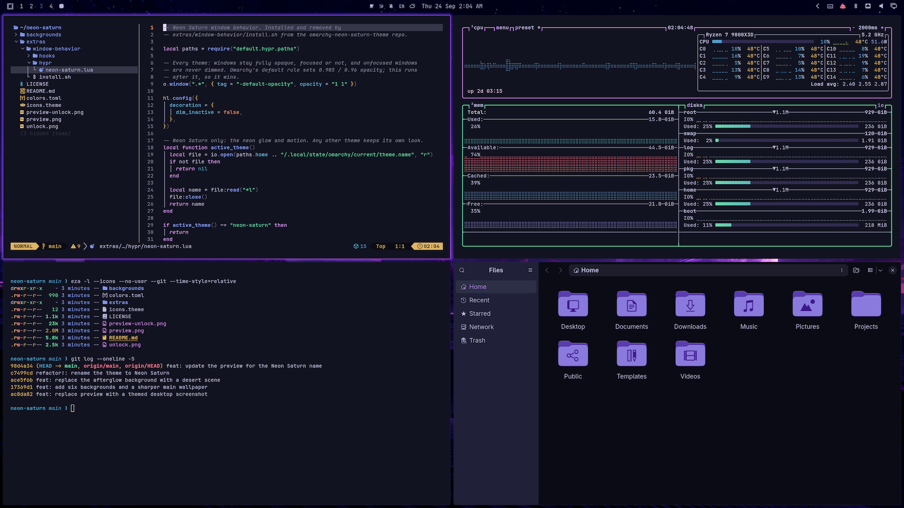

# Neon Saturn — Omarchy theme

A dark neon theme for [Omarchy](https://omarchy.org): a violet city at night under
a ringed moon. The reading surfaces stay calm, with a near-neutral ground and
violet-tinted text, and all the saturated neon goes into the window glow.



## Install

```bash
omarchy theme install https://github.com/NecturaLabs/omarchy-neon-saturn-theme.git
```

Or from the desktop: `Super + Space` → Install → Style → Theme, then paste the URL above.

The theme then shows up as **Neon Saturn** in the theme switcher. Built for Omarchy 4.

## What's included

| File | Purpose |
|------|---------|
| `colors.toml` | The palette. Omarchy generates terminals, Neovim, btop, the shell, Hyprland borders, the lock screen, VS Code, Obsidian, Claude Code and more from it |
| `icons.theme` | `Yaru-purple` icons |
| `backgrounds/` | Seven 4K (3840×2160) wallpapers and `omarchy.png`, the Omarchy logo on violet, listed below |
| `unlock.png`, `preview-unlock.png` | Lock screen artwork and its preview |
| `preview.png` | Theme switcher preview |
| `extras/window-behavior/` | The optional window behavior below. Nothing in it runs unless you install it |

## Optional: window behavior

The theme alone gives you the palette and the violet gradient border. The full
Neon Saturn desktop also changes how windows behave, and because Omarchy
never runs code from an installed theme, that part is a separate opt-in step.

On Omarchy the focused window follows the mouse, so the pointer moves focus
across windows all the time. Stock Omarchy makes every window slightly
transparent, and GTK apps restyle themselves when they lose focus, so that
movement makes the screen flicker. The window behavior makes focus change **only
the border glow**. Nothing else on screen changes.

| Change | Applies to |
|--------|-----------|
| Windows are fully opaque, focused or not (Omarchy's default is 0.985 / 0.96 opacity) | Every theme |
| Unfocused windows are never dimmed | Every theme |
| GTK apps (Files, dialogs, settings) are recoloured from the active theme's `colors.toml`: surfaces, accent, rounding, and sidebar selection in the Omarchy-menu style | Every theme |
| GTK3 and GTK4/libadwaita windows look the same focused and unfocused: no faded headerbars, dimmed labels, or dropped shadows | Every theme |
| GNOME accent colour set to purple | Neon Saturn (your previous accent comes back on other themes) |
| Violet glow around the focused window; unfocused windows cast no shadow | Neon Saturn |
| The focused border's gradient slowly sweeps around the window | Neon Saturn |
| Gaps 4/8 px, 1 px border, 4 px rounding, soft blur, short slide animations | Neon Saturn |

Install it after the theme:

```bash
~/.config/omarchy/themes/neon-saturn/extras/window-behavior/install.sh
```

- `--no-gtk` installs only the Hyprland part and leaves GTK apps alone.
- `--uninstall` removes everything it installed and restores what it replaced.
  Run it before you remove the theme, while the script is still on disk.
- Running it again refreshes the install, for example after updating the theme.

What it touches:

- `~/.config/hypr/neon-saturn.lua`, loaded by a three-line marked block at
  the end of `~/.config/hypr/hyprland.lua`. If Hyprland reports a new config error
  after the reload, the installer rolls this part back.
- Two hooks in `~/.config/omarchy/hooks/theme-set.d/` (`neon-saturn-gtk`,
  `neon-saturn-gtk-accent`), which regenerate `~/.config/gtk-3.0/gtk.css` and
  `~/.config/gtk-4.0/gtk.css` whenever the theme changes.
- If you already have your own `gtk.css`, the installer moves it to the backup
  folder, and `--uninstall` puts it back. The hook never overwrites a `gtk.css` it did not write.
- Every file it changes is backed up first to
  `~/.config/omarchy/backups/<UTC timestamp>-neon-saturn.XXXX/`.

Restart open GTK apps (for example `nautilus -q`) to pick up the stylesheets.
The GTK part needs `python3` and reads Adwaita's stylesheet from
`/usr/lib/libgtk-3.so.0`; it re-derives everything on each theme change, so
GTK updates are picked up automatically.

## Backgrounds

All 3840×2160. Cycle through them with `Super + Space` → Style → Background, or
`omarchy theme bg next`.

| File | Scene |
|------|-------|
| `1-neon-saturn.jpg` | The city skyline under the ringed moon, with a car on a curving elevated highway (the default) |
| `2-neon-rain.jpg` | Street level in the rain, violet neon reflected in puddles |
| `3-light-trails.jpg` | Aerial view of layered highways traced by violet light trails |
| `4-moonrise-shore.jpg` | Minimal: the moon rising over a calm sea, the city a thin line on the horizon |
| `5-rooftop-haze.jpg` | From a rooftop over a skyline sunk in violet fog |
| `6-ridge-overlook.jpg` | A pine ridge above the city glowing in a valley |
| `7-desert-run.jpg` | A violet-lit maglev train crossing desert dunes and mesas under the moon |
| `omarchy.png` | The Omarchy logo on violet |

## Palette

| Role | Hex |
|------|-----|
| background | `#191A26` |
| foreground | `#B8B6DA` |
| accent | `#B18DED` |
| selection | `#343051` |
| muted | `#82829C` |
| red | `#F47791` |
| yellow | `#DCB465` |
| orange | `#ED946C` |
| green | `#6BD8AC` |
| cyan | `#4F9DC8` |
| blue | `#7F95EC` |
| magenta | `#C385E5` |
| active border | `#8B44F0` → `#C85FFB` at 45° |

The background's OKLCH chroma is 0.024, inside the 0.000–0.030 range of
Omarchy's most comfortable stock themes, so long sessions don't strain the eyes.
The text carries the violet tint instead of the ground.

## Credits

- `1-neon-saturn.jpg` to `7-desert-run.jpg`: AI-generated for this theme.
- `omarchy.png` and `unlock.png`: the [Omarchy](https://github.com/omacom/omarchy)
  logo (MIT), recoloured.

## License

MIT, see [LICENSE](LICENSE).
